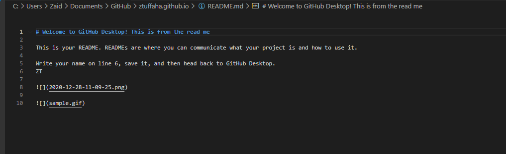

This is a new attempt at a new organizational electronic system for my notes and thoughts for 2021. Recently, I have pondered the ever-present question in my mind: what's the point of reading if you can't remember or use what you read? While I have seen first hand how effective organizational systems can be, I saw first hand how I'd fall out of habit. Organizational systems are like workouts- the simpler they are, the more likely I'll workout. My initial organization system was based on org mode and emacs but -like regexes- I would have to learn the shortcuts again once my memory retention period elapses and those configuration files became too cumbersome. 

I wanted to simplify note taking as much as possible, so here are my requirements:

- My notes, my files, my drive. I paid for services like Confluence. The switch away from a provider is difficult one from the data transition pov and that subscription keeps renewing. 
- Simple readable format that are expressive and feel at home in a text editor
- Paste images right into Markdown from the clipboard. In note taking, screen capture is life
- Publish some of my notes without worrying about maintaining domains, Wordpress, etc
- Automatic backups like I don't exist
- Least number of moving pieces
- Extendible notes that can be scanned later on build some recollection flashcards for the information I deem worth the bits and later on build a task list

So, this is my conglomeration:

- GitHub flavored Markdown for note taking 
- VS Code editor as a note taking software and 'Paste Image' plugin which allows me to paste an image into the file (behind the scenes, the plugin saves the image in a location visible to the file and adds Markdown syntax to embed the image). I still love you Notepad++. 
- For anything that I want to remember, I will add the following: QuestionAnswer.. The thought here is that I can write a simple parser that will scan for these tags and build a CSV file that imports into a slide deck for later review. 
- Git, GitHub and GitHub Pages to store, backup, and publish my files. Dropbox doesn't provide markdown preview. To start, I simply created a private repository for my drafts and another public repository to where I would check in the files I want to make public. 
- I use ScreenGif to take GIFs and edit them.
- All images and GIFs will be stored in GitHub as well- do not know the size limit here but I don't see it as an issue.
- Use one folder to house all my notes and rearrange as appropriate

So, what kind of things I intend to write about?

- notes and summaries from my PhD studies- 12 credits in so far...
- many many notes about bjj
- the first couple of chapters from Draco
- notes and summaries of audio books and podcasts (NOT Politics) 
- quotes and new words (things that I want to remember)
- journal entries about my ______ life and my _______ hats
- pickleball (that's right)... I even take notes on pickleball

What gets published is a quarter of that noise hopefully... This is a habit that I have been looking to foster for a while.. it's almost like a super power I tell you.. and I can even gif 

